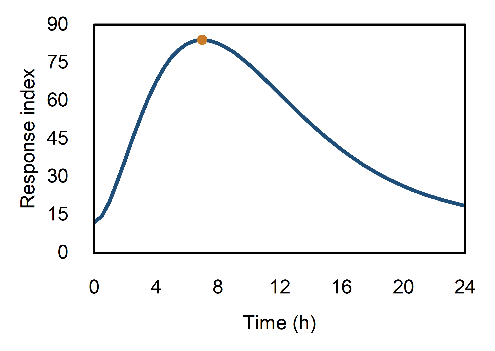
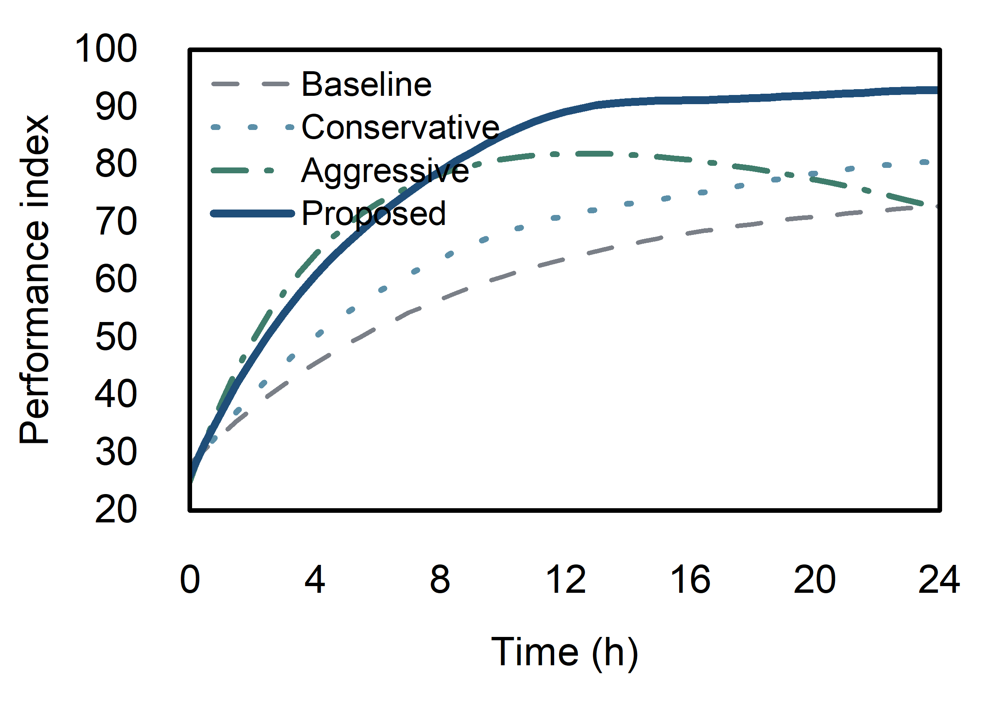
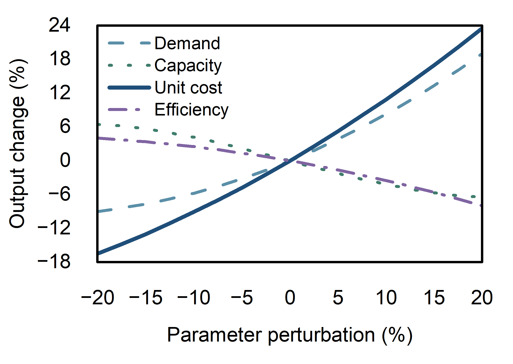
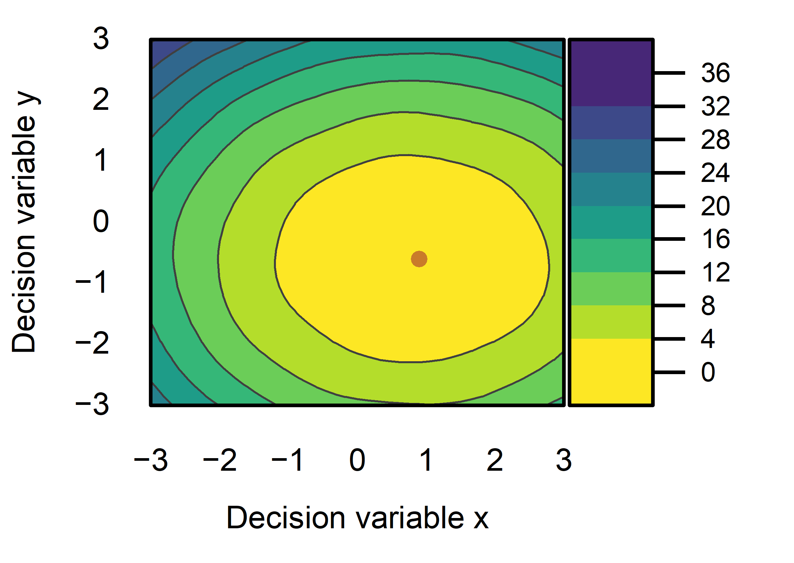

# First Style Review

Review date: 2026-08-30 (Asia/Shanghai)  
System version: Scientific Competition Premium v0.1  
Human decision: pending

## 1. Completion statement

The independent `ORIGIN_STYLE_SYSTEM` has been established without intentionally modifying the frozen `A_MODELING/core`, `A_MODELING/templates`, `A_MODELING/knowledge`, or `A_MODELING/AGENTS.md` paths. Four benchmark figures were built in the live Origin application through the configured Origin MCP server, exported, visually inspected, corrected, saved in one Origin project, and registered as candidate graph templates.

Nothing in this round is marked `FINAL`. Scores describe technical readiness; human aesthetic acceptance remains authoritative.

## 2. Origin MCP audit and connection

- Configured package: `origin-mcp` 0.1.4.
- Connected runtime: Origin 2026; bridge-reported version 10.350229.
- Verified inventory: 25 compact tools and 118 standard-profile tools.
- Initial incompatibility: the dedicated environment contained MCP SDK 2.1.1 while this server imports the MCP 1.x `FastMCP` interface.
- Repair: the dedicated Origin MCP environment was pinned to MCP 1.29.1. Tool enumeration, bridge ping, live Origin ping, graph creation, export, project saving, and template saving then worked.
- Execution path: a real MCP SDK stdio client launched the configured `origin_mcp` server; all Origin graph operations passed through registered MCP tools or the MCP-exposed documented LabTalk escape hatch.
- Full capability boundary: see `MCP_CAPABILITY_REPORT.md`.
- Reproducibility logs: `training_data/origin_mcp_tool_inventory.json`, `training_data/round1_mcp_execution.json`, and `training_data/round1_template_save.json`.

## 3. Design system established

- Semantic palette: Primary `#1F4E79`, Secondary `#5B8FA8`, Highlight `#C97B2A`, Neutral `#7A7F87`, Warning `#A63D40`; extensions are intentionally limited.
- Typography: Arial with a restrained axis-title, tick-label, legend, and annotation hierarchy.
- Figure language: white background, no decorative gradient/shadow/glow, no default grid, restrained line weights, inward ticks, concise legends, and rare semantic highlighting.
- Reuse: four verified Origin graph templates; no fake Theme file was created because no dedicated Theme-creation MCP endpoint was enumerated.
- Benchmark source data are deterministic and mathematically structured; no random-noise-only dataset was used.

## 4. Round-one figure summary

| Figure | Purpose | Total | Status |
|---|---|---:|---|
| B01 single line | MAIN | 94 | CORE FIGURE QUALITY — candidate |
| B02 multi-line | COMPARISON | 92 | CORE FIGURE QUALITY — candidate |
| B03 sensitivity | ANALYTICAL | 92 | CORE FIGURE QUALITY — candidate |
| B04 contour | MAIN | 90 | ACCEPTABLE — candidate |

### B01 — Single line MAIN

Figure: `B01_single_line_main`  
Purpose: MAIN  
Information: 19/20  
Scientific Accuracy: 20/20  
Readability: 14/15  
Visual Hierarchy: 14/15  
Color: 10/10  
Layout: 9/10  
Style Consistency: 8/10  
TOTAL: 94/100  
STATUS: CORE FIGURE QUALITY — CANDIDATE; not FINAL

Three highest-value improvements:

1. Test a slightly lighter frame weight at final manuscript scale.
2. Compare the current filled optimum marker with a smaller ring marker for dense future data.
3. Add a compact optimum value annotation only when the caption cannot carry it without repetition.

Transformations/disclosures: raw deterministic benchmark values; no smoothing, normalization, log scale, or axis truncation.  
Export verification: PNG 2400 × 1702 at 600 dpi; non-empty PDF and SVG; included in the saved OPJU.  
Human decision: pending.

### B02 — Multi-line COMPARISON

Figure: `B02_multi_line_comparison`  
Purpose: COMPARISON  
Information: 19/20  
Scientific Accuracy: 20/20  
Readability: 14/15  
Visual Hierarchy: 13/15  
Color: 9/10  
Layout: 8/10  
Style Consistency: 9/10  
TOTAL: 92/100  
STATUS: CORE FIGURE QUALITY — CANDIDATE; not FINAL

Three highest-value improvements:

1. Test a two-column or more compact legend when series names become longer.
2. Consider endpoint direct labels only for publication layouts that provide enough right margin; automatic data labels remain disabled by default.
3. Re-test grayscale output at the target journal column width, especially the two muted alternatives.

Transformations/disclosures: raw deterministic benchmark values; no smoothing or rescaling beyond the explicitly stated axes.  
Export verification: PNG 2400 × 1702 at 600 dpi; non-empty PDF and SVG; included in the saved OPJU.  
Human decision: pending.

### B03 — Sensitivity ANALYTICAL

Figure: `B03_sensitivity_analytical`  
Purpose: ANALYTICAL  
Information: 19/20  
Scientific Accuracy: 20/20  
Readability: 14/15  
Visual Hierarchy: 13/15  
Color: 9/10  
Layout: 8/10  
Style Consistency: 9/10  
TOTAL: 92/100  
STATUS: CORE FIGURE QUALITY — CANDIDATE; not FINAL

Three highest-value improvements:

1. Add very light x=0 and y=0 reference rules if they remain visible without competing with the curves.
2. Test a legend arrangement that uses less of the upper-left analytical region.
3. Evaluate whether line-style redundancy can be simplified for a color-only digital appendix while retaining the print-safe master.

Transformations/disclosures: benchmark-defined relative changes in percent; no post-plot normalization or smoothing. The initial y minimum of −12 would have clipped the unit-cost response (minimum −16.5), so the reviewed axis was expanded to −18 before final export.  
Export verification: PNG 2400 × 1702 at 600 dpi; non-empty PDF and SVG; included in the saved OPJU.  
Human decision: pending.

### B04 — Contour MAIN

Figure: `B04_contour_main`  
Purpose: MAIN  
Information: 18/20  
Scientific Accuracy: 20/20  
Readability: 14/15  
Visual Hierarchy: 13/15  
Color: 9/10  
Layout: 8/10  
Style Consistency: 8/10  
TOTAL: 90/100  
STATUS: ACCEPTABLE — CANDIDATE; not FINAL

Three highest-value improvements:

1. Add a concise color-scale title or unit once the modeled objective has real semantics.
2. Test a ring-plus-center optimum marker so it remains visible over either dark or light palette regions.
3. Compare the current discrete filled contour with a slightly denser level set, without implying more numerical precision than the 41 × 41 grid supports.

Transformations/disclosures: the regular 41 × 41 matrix is contoured in Origin; the highlighted point is the sampled-grid minimum, not a continuous optimizer result. Data range is 0.037876 to 32.512773; the reviewed color scale was expanded from 0–32 to 0–36 to prevent upper-end clipping.  
Export verification: PNG 2400 × 1702 at 600 dpi; non-empty PDF and SVG; included in the saved OPJU.  
Human decision: pending.

## 5. Reusable Origin artifacts

Verified candidate templates in `C:\Users\YiPian\.origin-mcp\templates`:

- `SCP_SINGLE_LINE_MAIN_v01.otpu`
- `SCP_MULTI_LINE_COMPARISON_v01.otpu`
- `SCP_SENSITIVITY_ANALYTICAL_v01.otpu`
- `SCP_CONTOUR_MAIN_v01.otpu`

Each has non-empty OTPU, JSON metadata, and PNG thumbnail files. The first save completed successfully. A later overwrite-only verification attempt timed out at the bridge, but the subsequent MCP template-library listing returned all four existing templates; no claim is made that the timeout itself succeeded.

No standalone Theme artifact exists in round one. The audited MCP has no dedicated create/save Theme endpoint, so cross-graph consistency is currently enforced by the templates, semantic palette, recipes, and formatting routine.

## 6. Export and project verification

- Four PNG files: each 2400 × 1702 pixels and 600 dpi.
- Four PDF files: non-empty and header-verified as PDF.
- Four SVG files: non-empty XML/SVG documents.
- Origin source project: `outputs/ORIGIN_STYLE_ROUND1.opju`, non-empty.
- Rendering script: `training_data/origin_round1.py`.
- Benchmark generator: `benchmarks/generate_benchmarks.py`.

## 7. Corrections learned during round one

1. FigureSpec page-size fields were not reliable for the target physical sizing in this MCP build; page and layer geometry were therefore set through verified formatting/arrangement operations.
2. Layer geometry accepted percentage-of-page values, not the initially assumed internal point-like values.
3. Default Origin templates may enable endpoint data labels. These produced large numbers outside the frame and are now explicitly disabled for every data plot.
4. Color-scale typography belongs to `Spectrum1.labels`, not the generic graphic-object font property.
5. Raster dpi is not exposed by the dedicated `origin_export_graph` schema. PNG export therefore uses documented `expGraph` settings through `origin_run_labtalk`; PDF and SVG use the dedicated export tool.
6. Axis and color-scale limits must be audited against actual extrema after styling, not merely assumed from the intended range.

## 8. Boundary and stop condition

The working directory is not a Git repository, so a Git diff cannot certify frozen-path identity. All file patches made for this task target `ORIGIN_STYLE_SYSTEM`; the only other intentional changes were the dedicated Origin MCP environment compatibility pin and the four requested user-template artifacts. No task command targeted the frozen `A_MODELING` paths.

Round one is complete. Stop here and wait for human aesthetic feedback before promoting templates, creating a Theme by an indirect route, or producing more graph types.
