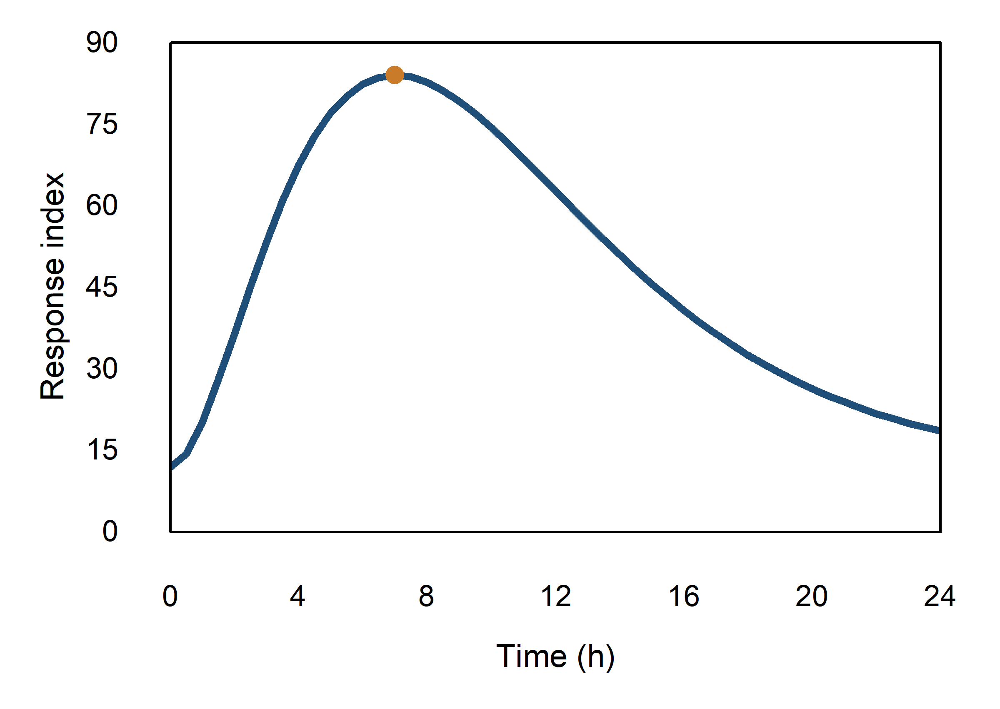
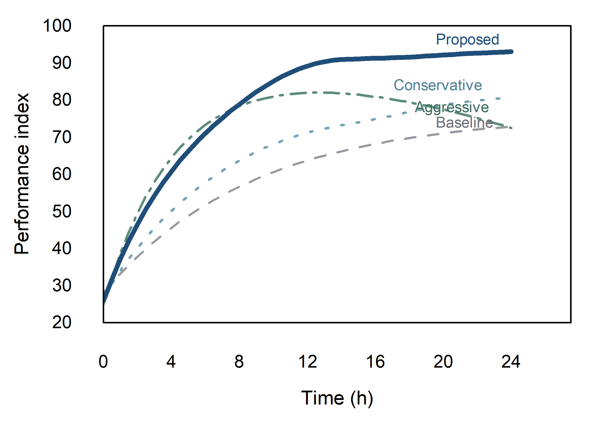
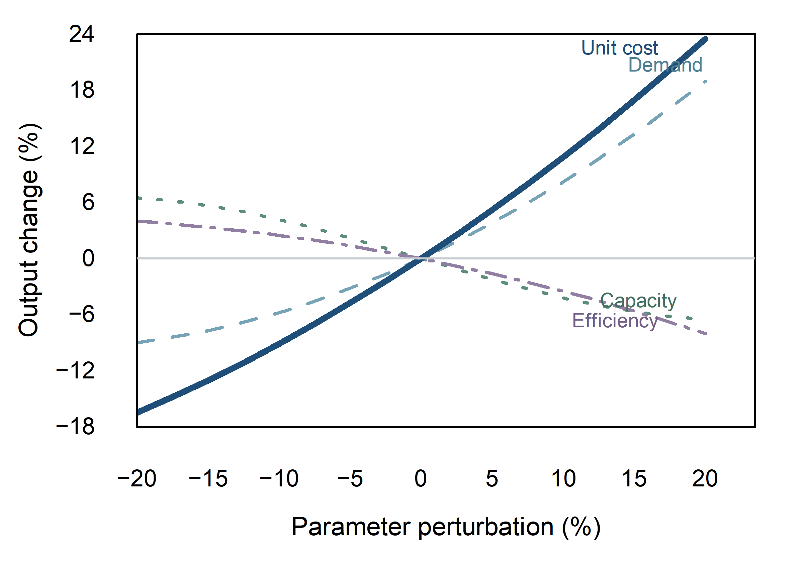
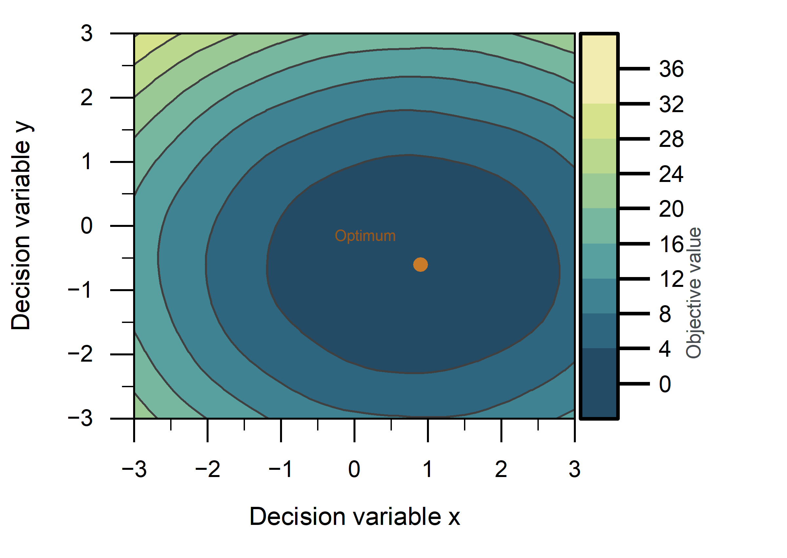

# Second Style Review

Review date: 2026-08-30 (Asia/Shanghai)  
Style name: **Signature Scientific Style v1**  
Keywords: **clean · restrained · publication-grade · analytical · premium**  
Human decision: awaiting next-round feedback

## 1. Completion statement

The four round-one benchmark figures were revised in the live Origin application through Origin MCP. The source data, core deep-blue/amber semantics, axis meanings, and scientific ranges were preserved. The work was incremental rather than a redraw: typography, frame weight, plot-area geometry, hierarchy, direct labeling, analytical references, and the contour/colorbar system were refined.

All four final figures were exported as PNG, PDF, and SVG and saved together in `outputs/round2/ORIGIN_SIGNATURE_STYLE_V1_ROUND2.opju`. Four corresponding v02 Origin user templates were also saved. This review remains a round-two candidate record, not a claim of final human approval.

## 2. Round-two result overview

| Figure | Main intervention | Self-score | Assessment |
|---|---|---:|---|
| R2_B01 single line | lighter frame, smaller type/marker, larger data rectangle | 96/100 | signature mother-figure candidate |
| R2_B02 multi-line | legend removed; colored endpoint labels; auxiliaries muted | 95/100 | hierarchy materially improved |
| R2_B03 sensitivity | `y=0` analytical rule; direct labels; Unit cost promoted | 95/100 | analysis reading materially improved |
| R2_B04 contour | custom continuous palette; narrow labeled colorbar | 94/100 | now belongs to the same design system |

Scores are provisional internal judgments. The next human aesthetic decision is authoritative.

## 3. Figure-by-figure review

### R2_B01 — Single line MAIN

**本轮改了什么**

- Axis titles were reduced to 6.5 pt and tick labels to about 5.8 pt.
- Axis/frame language was reduced to 0.45 pt.
- The plot rectangle increased from 75% × 65% to 77% × 69% of the page.
- The amber optimum marker was reduced from 3.8 pt to 3.3 pt, about 13%.
- Background is pure white; routine grids and automatic endpoint values are off.

**为什么改**

The first-round figure was clear but visually enlarged. Smaller type, finer axes, and a slightly larger data rectangle shift the figure from presentation scale toward manuscript scale while retaining the curve as the first visual object.

**是否提高统一性与高级感**

Yes. It establishes the v1 mother-figure proportions used by the other line charts: the same 6.5/5.8 pt type hierarchy, 0.45 pt frame language, Primary stroke, and Highlight marker size.

### R2_B02 — Multi-line COMPARISON

**本轮改了什么**

- The four-entry legend was removed.
- `Baseline`, `Conservative`, `Aggressive`, and `Proposed` are labeled near their curve ends in their semantic colors.
- Proposed remains deep navy at 1.50 pt; Baseline is light gray at 0.75 pt; Conservative is light blue-teal at 0.85 pt; Aggressive is muted green at 0.90 pt.
- The x-axis presentation range was extended from 24 to 27.5 solely to provide label space; no data values were added or altered.
- Type, axes, background, and plot rectangle follow the B01 v1 mother-figure.

**为什么改**

The round-one legend consumed the strongest unused region and competed with the curves. Direct identification removes eye travel and gives the Proposed result immediate rhetorical priority. Reducing the three auxiliary stroke weights prevents four equal-strength conclusions.

**是否提高统一性与高级感**

Yes. The figure now uses semantic color and stroke weight as a controlled hierarchy rather than a default equal-weight line set. It shares the same type, axes, margins, white background, and Primary/Highlight language as B01.

### R2_B03 — Sensitivity ANALYTICAL

**本轮改了什么**

- A light-gray `y=0` reference rule (`#C6CBD1`, approximately 0.45 pt) was added.
- The legend was replaced by colored endpoint labels.
- Unit cost is the 1.50 pt deep-navy Primary; Demand, Capacity, and Efficiency are 0.90 pt supporting curves.
- Purple is retained only for the necessary fourth response and is deliberately muted.
- The x-axis presentation range was extended from 20 to 23.5 for label space; the response data remain unchanged.
- Type, frame, plot area, and background were standardized to v1.

**为什么改**

The zero rule turns the figure from a generic multi-line chart into an analytical reading surface: sign changes, positive/negative influence, and comparative sensitivity are visible immediately. Direct labels reduce decoding time, while the Primary role makes the most sensitive response the first conclusion.

**是否提高统一性与高级感**

Yes. The figure now matches B02's direct-label system and hierarchy, but adds only the one analytical guide required by its scientific purpose.

### R2_B04 — Contour MAIN

**本轮改了什么**

- The default viridis-like field appearance was replaced with a custom low-saturation dark-blue → cyan → green → light-yellow sequence, without a purple endpoint.
- The colorbar thickness was reduced from 240 to 125% of label-font height.
- The colorbar now carries the vertical label `Objective value`.
- Contour boundaries were reduced to about 0.28 pt.
- The amber optimum marker was reduced to 3.3 pt and accompanied by a small restrained `Optimum` label.
- The contour plot rectangle increased from 52% × 65% to 56% × 69%, retaining sufficient room for the colorbar and its title.

**为什么改**

Round one read as three custom line figures plus one software-default contour. The new palette reuses the system's blue/teal/green vocabulary and reserves warm amber for the optimum. The narrower, explicitly labeled colorbar carries quantitative meaning without becoming the second focal object.

**是否提高统一性与高级感**

Yes. The field now uses the same restrained saturation, fine-line language, white page, compact type, and amber conclusion marker as the line figures. It is no longer visually detached from the set.

## 4. 人工审美反馈落实情况

| 人工意见 | 本轮落实 |
|---|---|
| 字体偏大 | Axis titles changed from the round-one 8 pt treatment to 6.5 pt; ticks from 7 pt to about 5.8 pt; direct labels are 4.8–5.2 pt. The reduction is approximately 15–25% depending on role. |
| 边框过重 | Axis/frame thickness was set to 0.45 pt, with lighter tick thicknesses. The contour retains a fine registration frame; line figures use the same reduced-weight language. |
| 图例过抢 | Legends were removed entirely from B02 and B03 and replaced by endpoint direct labels. B01 and B04 require no legend. |
| 绘图区偏保守 | Line-plot geometry increased from 75% × 65% to 77% × 69%; contour geometry increased from 52% × 65% to 56% × 69%. Left/top margins were reduced only to the point that titles remain uncut. |
| 敏感性图需 0 参考线 | B03 now has a single light-gray `y=0` analytical reference. It is thinner and lighter than the data series. |
| contour 图色带需重做 | B04 uses the custom ten-step `#244B66` to `#F2ECB1` sequence: low-saturation blue–cyan–green–light-yellow, with no purple end. |
| contour 图 colorbar 需更精致 | The colorbar is about 48% of its previous thickness, uses smaller labels, and has a vertical `Objective value` title. |
| 全套要进一步强化“主次层级” | Primary results use deep navy and 1.45–1.50 pt strokes; auxiliaries use lighter semantic colors and 0.75–0.90 pt strokes; Highlight amber is restricted to optima; legends and generic grids were removed. |

## 5. Scientific and transformation disclosures

- No benchmark values were smoothed, normalized, or statistically transformed.
- B02 and B03 received right-side axis space only for direct labels. Their data endpoints remain 24 h and 20% perturbation respectively.
- B03's y range remains −18 to 24 so the minimum Unit cost response is not clipped.
- B04 uses the original 41 × 41 objective matrix, the same 0–36 color-scale limits, and 4-unit contour intervals. The highlighted point remains the sampled-grid minimum rather than a continuous optimizer result.
- All pages and plotting layers render on pure white. No gradient background, shadow, glow, or decorative 3D effect was introduced.

## 6. Origin MCP and reproducibility record

- Live runtime: Origin 2026, bridge-reported version 10.350229.
- Renderer/exporter: `training_data/origin_round2.py`.
- MCP execution log: `training_data/round2_mcp_execution.json`.
- Template log: `training_data/round2_template_save.json`.
- Compatibility audit: `training_data/round2_labtalk_audit.json`.
- Source project: `outputs/round2/ORIGIN_SIGNATURE_STYLE_V1_ROUND2.opju`.

One long LabTalk style statement initially returned false because `page.color` is unsupported in this Origin property context. The final renderer separates verified properties, sets the graph layer to pure white, disables automatic data labels after plot styling, and records the successful calls. The Python/R-only figure skill was not used as a plotting backend; only its backend-neutral publication QA principles were applied. Origin MCP remains the sole figure-production path.

## 7. Updated templates

Verified v02 templates in `C:\Users\YiPian\.origin-mcp\templates`:

- `SCP_SINGLE_LINE_MAIN_v02.otpu`
- `SCP_MULTI_LINE_COMPARISON_v02.otpu`
- `SCP_SENSITIVITY_ANALYTICAL_v02.otpu`
- `SCP_CONTOUR_MAIN_v02.otpu`

Each template has a non-empty OTPU file, JSON metadata, and PNG preview. The v01 templates remain preserved. Direct-label positions are data-dependent; future datasets should be applied through the v1 recipe/renderer so endpoint labels are repositioned rather than treated as static decoration.

## 8. Stop condition

Second-round revision is complete. Stop here and wait for the next human aesthetic feedback before further modification or promotion to a final standard.
